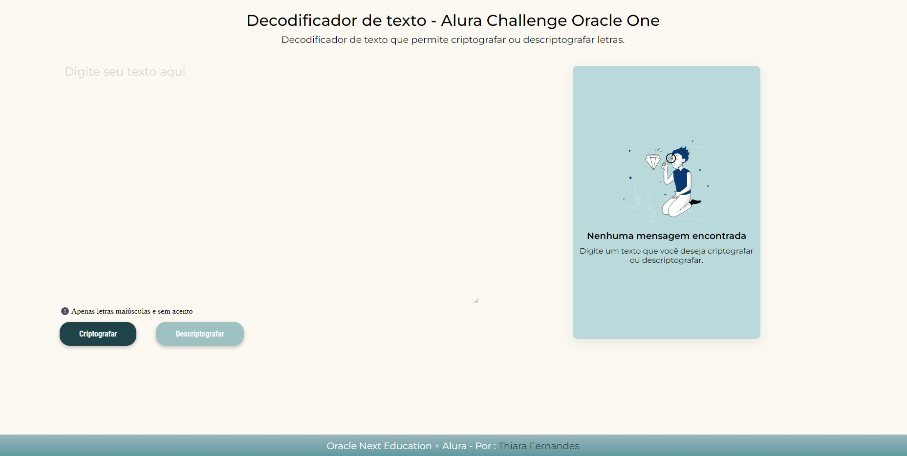
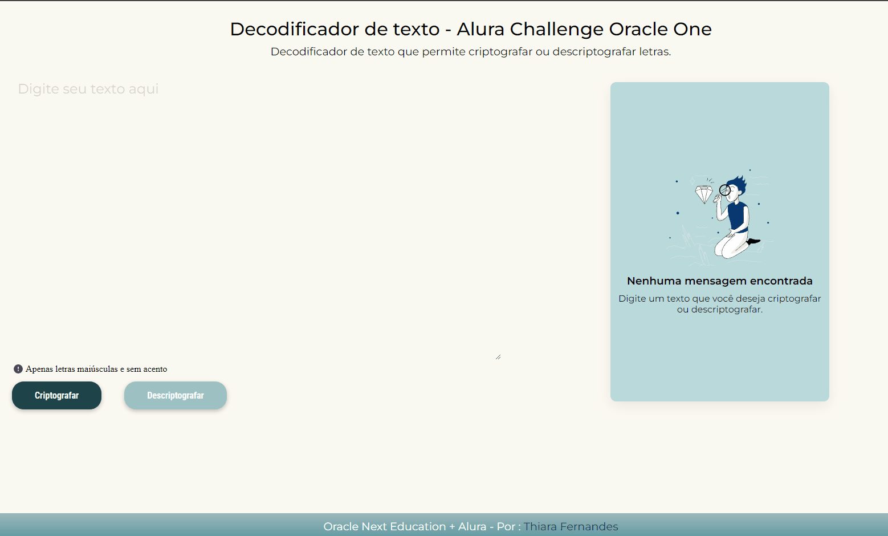
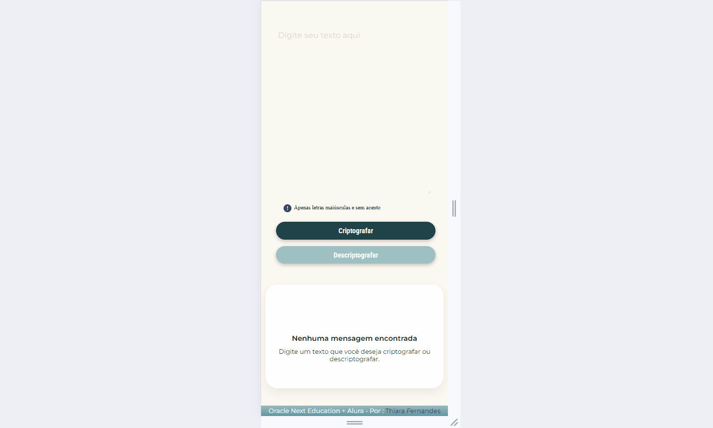

 
 

# Decodificador de mensagens secretas
  #### Projeto desenvolvido no programa ONE - Alura e Oracle
  Um decodificador de mensagem secreta é uma ferramenta ou método usado para revelar o conteúdo oculto em uma mensagem codificada. Ele funciona desfazendo a criptografia ou o código usado para esconder a mensagem original.
  

  ## 🛠️Funcionalidades do projeto
  Projeto com design responsivo que permite que o usuário acesso de dispositivos diferentes.

  ## Tecnologias utilizadas
   - HTML
   - CSS
   - JavaScript

   ## Designer responsivo
   

